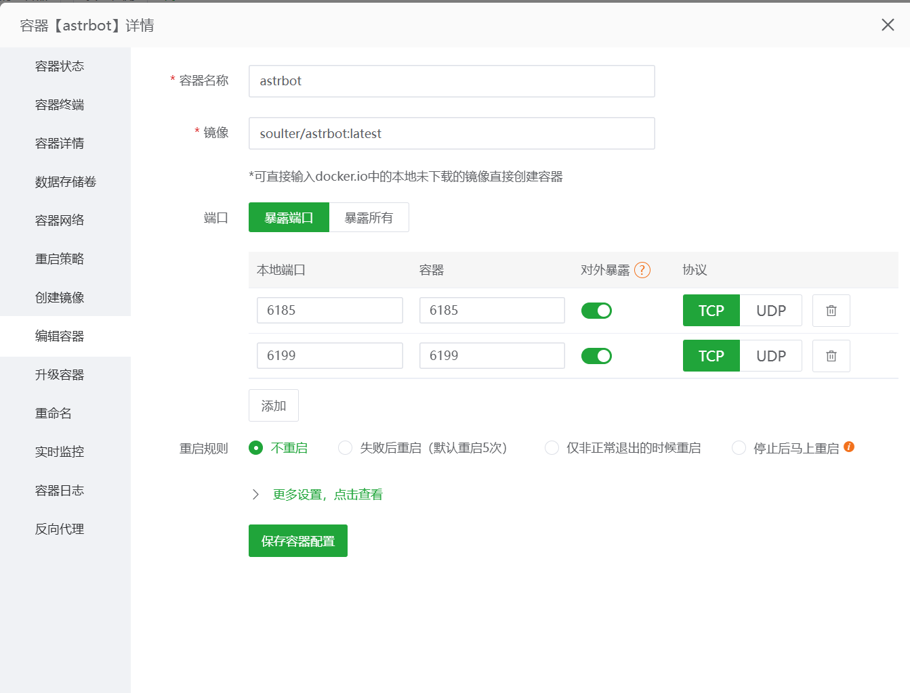
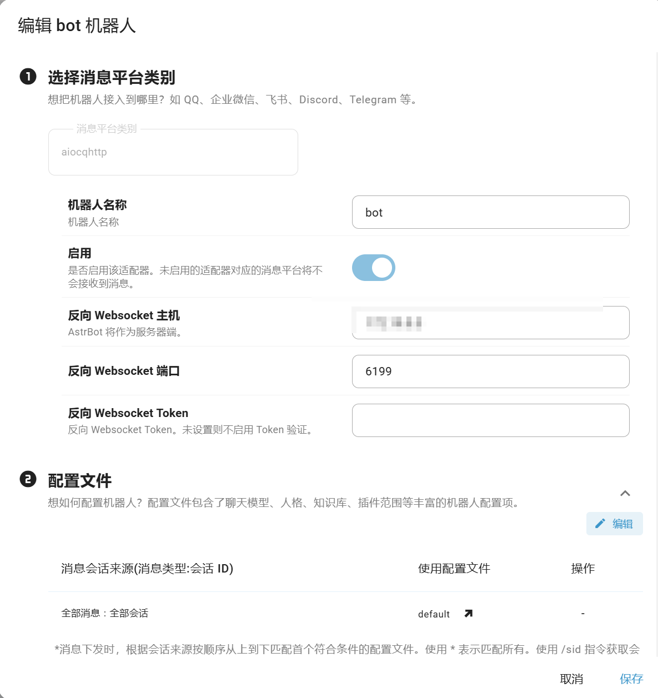
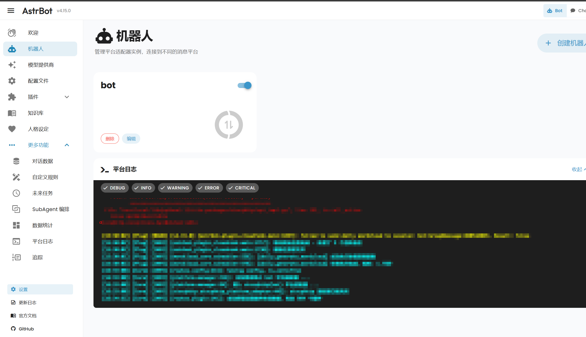
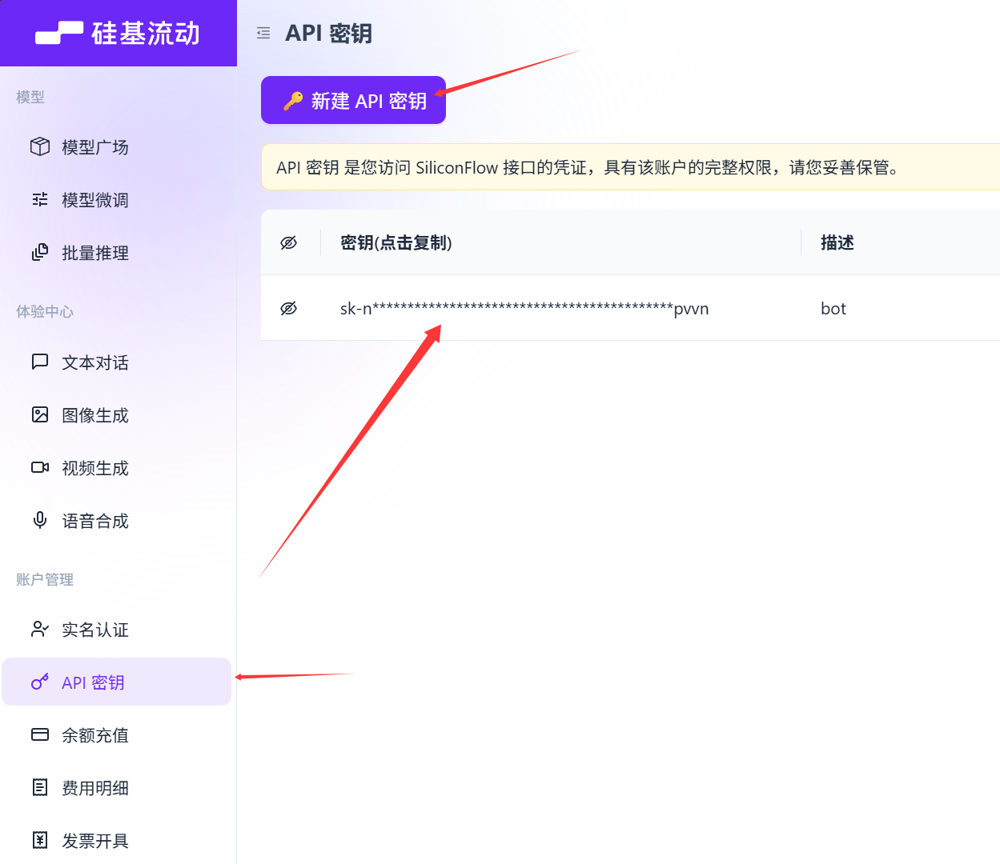
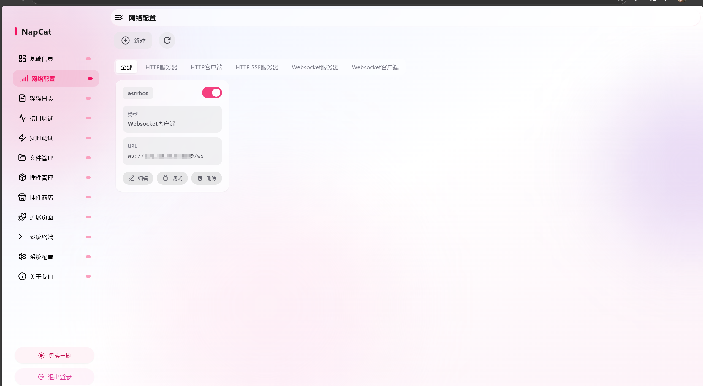
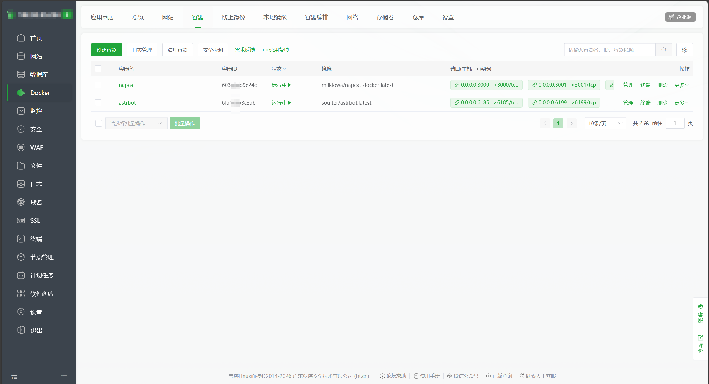

> 有点无聊，没人聊天，那就自己搭个bot玩~
>
> 如果该文章略有不明白，可以尝试运用你的搜索能力，继续上网搜索，结合看看呢~
# 事先准备
需要准备好一台linux*服务器*，一个闲置qq号，一个可以调用API的平台（以硅基流动为例子），服务器用的阿里云2核2G，有钱可以上更好的

## 安装Astrbot+Napcat
连接你的服务器，没进root账户的记得在终端输入*sudo -i* 进入你的root账户
```bash
sudo -i
```
选择采取更方便的宝塔面板安装
```bash
if [ -f /usr/bin/curl ];then curl -sSO https://download.bt.cn/install/install_panel.sh;else wget -O install_panel.sh https://download.bt.cn/install/install_panel.sh;fi;bash install_panel.sh ed8484bec
```
执行命令，等待安装完成

安装完毕后应该会出现
```text
【云服务器】请在安全组放行 xxxx 端口
 外网ipv4面板地址: https:xxxxx
 内网面板地址:     https:xxxxx
 username: xxxxx
 password: xxxxx

```
把这些记下来，然后去你服务器的防火墙上放行这个端口

流程：防火墙 -> 添加规则 -> 自定义 协议选TCP 端口填上给你的 然后默认0.0.0.0/0就行 可以自行打个备注

放行之后复制外网ipv4面板地址，浏览器打开，登录宝塔页面，会跳出初始化推荐配置四条，这里选docker就好

然后耐心等待安装

接下来安装好docker可以开始安装astrbot+napcat了~

参考官方文档[通过 Docker Compose 部署](https://docs.astrbot.app/deploy/astrbot/docker.html)  

你也可以通过宝塔面板的docker菜单，应用程序里搜Astrbot，这里演示命令安装

```bash
mkdir astrbot
cd astrbot
wget https://raw.githubusercontent.com/NapNeko/NapCat-Docker/main/compose/astrbot.yml
sudo docker compose -f astrbot.yml up -d
```
安装完直接去宝塔的docker界面启动容器即可，有网络问题配置下镜像，记住下端口，全部去防火墙放行

## 配置Astrbot+Napcat

最重要的是把你的Astrbot和Napcat放在同一个网络环境下

去宝塔 docker -> 网络  添加网络，名字例如astrbot-napcat

继续选择容器，在容器 -> 管理 -> 容器网络  让两个容器都加入你刚刚创建的那个astrbot-napcat网络，并且退掉别的网络，仅仅保留这一个
 
记一下astrbot容器的IPV4地址~

### Astrbot+API
docker里配端口 编辑容器那里

本地端口-->容器

6185-->6185/tcp

6199-->6199/tcp

放行了你的端口后直接用你的服务器公网ip+端口号进入你的Astrbot，默认用户名密码astrbot

应该会有一个引导，按照引导创建机器人，消息平台类别我们不走qq官方，用的自己号

所以选择Onebot v11

名字自己写，然后反向 Websocket 主机填入你刚刚记的astrbot容器的IPV4地址，其余可以不用管，可以加token验证但是可以没必要





接下来配置API，跟着引导走，选择siliconflow，ID填siliconflow 然后API Key去你的硅基流动里API密钥复制过来，下面是配置的模型，可以自己选，文本可以选deepseek之类的，识图模型选带VL的，自行选择即可，如果是新人会有免费代金券玩，也可以自行氪

### Napcat
在宝塔docker里配一下端口 

3000-->3000/tcp

3001-->3001/tcp

6099-->6099/tcp

防火墙放行

第一次登录记得在docker里Napcat，容器日志里找token，扫码登录

新建一个网络配置，选择Websocket客户端，URL填ws://（你刚刚记的astrbot容器的IPV4地址）:（端口号，默认应该6199）/ws

心跳间隔和重连间隔全部5000，保存即可


然后看Astrbot的平台日志显示适配器已连接即可，到这里就结束了，可以尝试给你的bot发个消息看看

部署结束~撒花




## 继续完善Astrbot
装插件也是不得不品鉴的一关，直接在Astrbot的插件市场自己选择即可，建议加个消息防抖动

然后配置文件可以自行看着配置~手动DIY

人格设定就随便玩了，想加什么设定都好，这里就自己来，剩下的都可以自己摸索着玩，更多操作全自己探索就好了

## 一些报错处理
请注意你的防火墙是否放行全部端口

2核2G服务器很容易出现爆CPU的情况，需要重启服务器，重新启动容器...

重新启动容器如果出现bot报错，请检查你的astrbot的ipv4是否更改了，填入新的ipv4地址即可解决

如果配置好了仍旧出现配置器未连接，请尝试对话，如果能正常对话则不用理会

---

> 欢迎共同探讨 QQ : 858617595